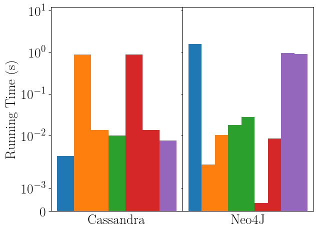

# Abstract
Asking "What stars are near S?" is a problem that may involve iterating through millions, if not billions of stars. The time to answer similar questions using the Tycho-2 dataset with the  distributed column family database Apache Cassandra, was benchmkared against the distributed graph database Neo4J using the same dataset. Overall, Cassandra's query times are more tightly distributed than Neo4J, but Neo4J is able to process queries faster if the correct indexes are applied.

# Tycho-2 Dataset
In order to make informed decisions about our data model, we need to understand our data: a star catalog. A star catalog is a collection of stars, their positions, and other traits,enumerated & identified by their catalog numbers. The bulk of the Tycho-2 star catalog comes from the ESA (European Space Agency) astrometric mission Hipparcos. This dataset is available at ftp://cdsarc.u-strasbg.fr/pub/cats/I/259.

# Data Models

## Relational Data Model
The relational data model is the most popular data abstraction, and arguably the most natural. Here data is stored in n-dimensional vectors known as tuples. The schema is defined before data is added, meaning that each tuple of a given set has the same length. If thought of as a table, the number of columns is fixed while the number of rows is variable. Interaction between this model involves the use of relational algebra (typically implemented as SQL).

In terms of distributed relational DBMSs, most implementations are consistent, available, but not partition tolerant. This means that every read will always receive the most recent write. Given that our database is static, the biggest concern is partition tolerance. Our system may not operate with message loss across a cluster of computers (nodes).

## Column Family Data Model
The column famly data model can be very loosely thought of as the segmentation of a relational table into several two column tables consisting of a single attribute of the original table and a primary key based off this attribute. These segmented tables can then be grouped into a column family, which represents a group of columns indexed by the same primary key. This segmentation is useful for allowing denormalization, meaning that the schema does not have to be defined before
data insertion and that each primary key does not have to map the same amount of columns as other keys. Column family models are known for this denormalization and efficient querying, accessing only the columns required for the query itself. Cons here include restrictive queries, as columns can only be accessed using their primary key.

_Apache Cassandra_ is the column store database that is being tested here, and is a form of a _distributed_ DBMS. Cassandra itself is available and partition tolerant, but not consistent. Data in a Cassandra cluster is hash partitioned by the primary key with the additional option of being replicated across the cluster. Cassandra’s querying language CQL allows for queries without the primary key, but at the cost of performance.

## Graph Data Model
Relative to the relational data model, the graph data model focuses on the relationship between various tuples. Here data is stored in nodes as attributes, and relationships are stored as edges between nodes. Data is accessed by searching for nodes or edges, and traversing the graph. Compared to the relational data model, graph data models shine in relationship querying and denormalization. Compared to the column family where data can easily be partitioned across nodes, a graph data model does not allow for the same amount of parallelism.

Neo4J is the graph database that is being tested here, and is also a form of a distributed DBMS. The Neo4J setup that was tested here is available and consistent, but not partition tolerant (like a typical distributed RDBMS). Because data in a Neo4J graph cannot be partitioned like Cassandra, every node in a cluster is a full replica.

# Methods
Queries represent read operations on some DBMS. Write operations were not tested here, as stars have not added to this dataset in years. For simplicity, a star is defined as near to another star if they share the same region. A star is naked-eye visible if its BTmag field (apparent magnitude) is below 6.0.

The following queries are to be examined:
1. What are the characteristics of some star S?
2. Which stars are near some Equatorial position (alpha, delta)?
3. Which stars are near some star S, and what are their characteristics?
4. Which stars are near some Equatorial position (alpha, delta), and are naked-eye visible?
5. Which stars are near some star S, and are naked-eye visible?

Query 1 is a singular element search across the entire database. Query 2 involves searching for some region that contains our point, and utilizing the data associated with the region to search for stars. This query can be approached two ways: computing the region ID given our point as application logic and searching with this ID, or by searching with the bounds fields associated with each region. Query 3 involves searching for all stars that share the same TYC1 field. Neo4J has the additional option of searching for the associated Region node and walking each edge to the corresponding Star node. Queries 4 and 5 are similar to 2 and 3 with an additional brightness filter.

Each general query was translated into 22 different queries for specific stars or locations. When referencing the time to execute query 1 or 2, it is implied that this is the time to execute any of one the specific queries for query set 1 or 2 on average.

# Results

_Caption: Running times of different queries for a 3-node Neo4J cluster and a 3-node Cassandra cluster. Each point represents the average of 15 runs. The blue bars represent query 1, the orange represent queries 2A and 2B, the green represents queries 3 (Cassandra), 3A and 3B (Neo4J), the red represents queries 4A and 4B, and the purple represents queries 5 (Cassandra), 5A and 5B (Neo4j)._

Our results show that Cassandra runs faster when Neo4J is not indexed, but Neo4J is able to run just as efficiently (in some cases, more) when the correct indexes are applied. Cassandra queries benefit from taking the time to determine the primary key before asking Cassandra (time-space tradeoff), instead of performing an exhaustive search on Cassandra itself. Neo4J does not experiment this same performance boost. Finally, Cassandra appears to perform the same under a change in cluster size while Neo4J does not. For consistent performance, Cassandra should be selected. For a more natural abstraction with a higher upper bound on performance, Neo4J should be selected.

View the entire paper [here](https://github.com/glennga/tycho-query/blob/master/doc/paper.pdf).
